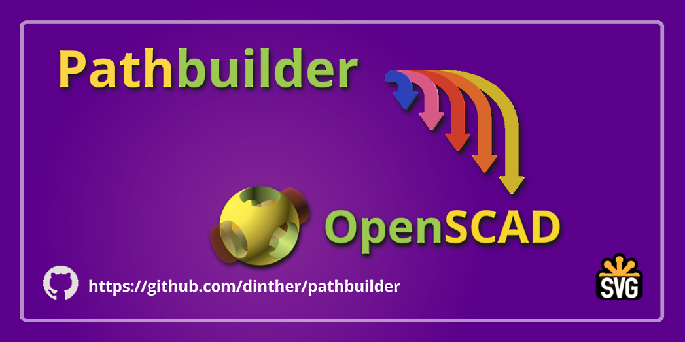
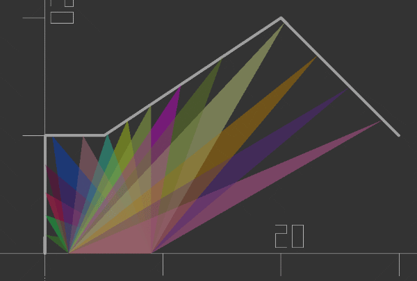

# Introduction


Pathbuilder is a tool for openSCAD that make the creation of complex 2D shapes easier with a syntax similar to the one used for svg path. Pathbuilder supports [the complete svg command set](https://developer.mozilla.org/en-US/docs/Web/SVG/Attribute/d#path_commands) (except arc not complete yet)  and several extra commands to make the creation of 2d shapes as easy as possible.

You can place filets or Chamfers at any point. Extend lines up to an arbitrary boundary and much more.

# Installation
Pathbuilder is contained in a single .scad file and in has no dependencies on other libraries. Just copy pathbuilder.scad to your openSCAD library folder and put 
```
use <pathbuilder.scad>
```
at the top of your code unit and you are ready to go. Copy this code into a new blank openSCAD file to make sure it all works. Dont forget to check out the [pathbuilderdemo.scad](pathbuilderdemo.scad) it contains 6 examples on how Pathbuilder can be used.

### Quick test
```
include <pathbuilder.scad>

svgShape("m 0 0chamfer8h20fillet2v20fillet10h20v-10fillet2l35 20fillet2l-35 20fillet2v-10h-40fillet30z");
```
You should see this.


# flexible

There are two ways to use pathbuilder. You can use a normal svg path string in Pathbuilder. This means that you can also draw your shapes in vector drawing programs such as inkscape and copy the path string into Pathbuilder.

However the power of openSCAD is of course in its parametric capabilities. Although you could string together an svg path string with some variables, it isn't exactly elegant.

Therefore pathbuilder also offers access to every command directly in your code. Commands are simply chained just like you are used to with openSCAD. A polygon is drawn at the end of the command sequence. This way you can pass in your parameters directly into pathbuilder command modules.

Each method has its own benefits and drawbacks. The SVG path string method can create a polygon or return a point list which you can manipulate as desired. But modules also allow a much finer control over the curve segmentation as you can slip in a $fa, $fs or $fn parameter with every command module.

# Rip and pillage
If Pathbuilder isn't quite your thing you might still was to have a look at some of the functions. Pathbuilder has no dependencies and the functions have been written as self contained as possible and sensible.

Here are just a few examples:

```
function curveBetweenPoints(pt1, pt2, radius, incl_start_pt = true)
```
Returns a list of points representing the shortest curve between two points with a given radius.

```
function fillet(pts, index, radius)
```
Returns a list of points representing an arc with a given radius that is the tangent to pt1 and pt2 also known as a fillet.
```
function chamfer(pts, index, size)
```
Returns two points for a nice balanced symetrical chamfer of size for a given point in the point list.

# Command overview
Here is a quick overview of the commands implemented so far. Check out the detailed [command documentation in the wiki](https://github.com/dinther/pathbuilder/wiki)

Most path commands have an uppercase and a lowercase version in Pathbuilder. This is an important distriction because the case defines if the command works in absolute coordinates `(Uppercase)` or relative `(lowercase)` from the current point. More about this in the wiki. In this overview I ignore the details case has on the commands.

## High level commands
When using the SVG path syntax in string format you will need to call a function to have the commands in the string processed. The main two are at the top of this list. The other three are more useful as debugging tools.

|Command|Code|Description|
|-------|----|-------|
|svgShape|`svgShape(path_string)`|This command takes a svg path string as input and creates a polygon with the defined shape. Segmentation of curves are according $fn, $fa, $fs and $pb_spline.|
|svgPoints|`svgPoints(path_string)`|This command takes a svg path string as input and returns a 2D point list. Here you can do additional processing of your shape data.|
|pb_tokenizeSvgPath|`pb_tokenizeSvgPath(path_string)`|Turns the path string into a list of unambiguous commands and returns this command_list. Useful for debugging.|
|pb_processCommands|`pb_processCommands(command_list)`|Executes the commands in the list and builds up a point list and a post processing list. These two lists are returned in a data list.|
|pb_postProcessPath|`pb_postProcessPath(data)`|Post processing involves applying fillets and chamfers now the main shape is known. A 2D point list is returned.

Checkout [pathbuilderdemo.scad](pathbuilderdemo.scad) demo 3 which shows a third way to interpret process the svg path string. Here three separate steps are taken to go from path string to 2D point list.
```
    cmds = pb_tokenizeSvgPath(pb_swoosh);
    data = pb_processCommands(cmds);
    pts = pb_postProcessPath(data);
    polygon(pts);
```
***
## SVG Commands:
The commands in this table should be fully compliant with the SVG path syntax.

|Command|Code|Description|
|-------|----|-------|
|[M or m](https://github.com/dinther/pathbuilder/wiki/Move-to)|`"m x y"` or `m(x,y)` or<br>`m([x,y,...])`|Move must be the first command and sets a start point.|
|L or l|`"l x y"` or `l(x,y)` or<br>`l([x,y,...])`|Line adds a point to the point path.|
|H or h|`"h x"` or `h(x)` or `h([x,...])`|horizontal line to x.|
|V or v|`"v y"` or `v(y)` or `v([y,...])`|vertical line to y.|
|C or c|`"c cx1 cy1 cx2 cy2 x2 y2"` or<br>`c(cx1,cy1,cx2,cy2,x2,y2)` or<br>`c([cx1,cy1,cx2,cy2,x2,y2,...])`|Draws a cubic spline to x2,y2 where cx1,cy1 controls the entry angle/shape and cx2,cy2 controls the exit angle/shape.|
|S or s|`"s cx cy x y"` or<br>`c(cx,cy,x,y)` or<br>`c([cx,cy,x,y,...])`|Draws a smooth cubic spline continuation to x,y where cx,cy controls the exit angle/shape. The entry control point comes from a prior cubic spline if there was one otherwise the entry angle/shape initially starts like a line to x,y.|
|Q or q|`"q cx, cy, x, y"` or<br>`q(cx,cy,x,y)` or<br>`q([cx,cy,x,y,...])`|Draws a quadratic spline to x,y. Control point cx,cy is shared between the current point and x,y.|
|T or t|`"t x y"` or `t(x,y)` or `t([x,y,...]`|Draws a smooth quadratic spline continuation to x,y using the control point from the previous quadratic spline. This sequence must start with a regular quadratic spline otherwise you get straight lines.|
|A or a<br>(not ready)|`"a rx ry a lf sf x y"` or<br>`a(rx,ry,a,lf,sf,x,y)` or <br>`a([rx,ry,a,lf,sf,x,y,...])`|Drawn an arc of a ellipse segment to x,y with radii rx and ry with the ellipse rotated to angle a. lf and sf flags select from 4 possible solutions. lf short way (0) or long way(1) and sf: cw (0) or ccw (1)|
***
<br>Example of using the forward command with a polyline boundary

## Extra path commands:
These are extra commands introduced by Pathbuilder. The command set is not settled yet. In fact, only fillet and chamfer are likely to remain as they are. angle, polar and forward could be rolled into a single command.
|Command|Code|Description|
|-------|----|-------|
|Angle or angle|`"angle a"` or `angle(a)`|Changes the currentexit angle from the last command.|
|Forward or forward|`"forward d ..."` or<br>`forward(d)` or<br>`forward([x1,y1,x2,y2...]`|Extends a point in the direction of the current exit angle. This point can be at distance d or until a polyline is intersected formed by x,y value pairs.|
|Polar or polar|`"polar d a"` or `polar(d,a)`|Draws a line to a point d distance away and angle a.|
|Segment or segment|`"segment x y r"` or `segment(x,y,r)` or `segment([x1,y1,x2,y2...],r)`|Draws the shortest circle segment between current point and x,y with radius r. Make r negative to change the curve from CW to CCW or vice versa. **depricated**|
|fillet|`"fillet r"` or `fillet(r)`| Replaces the current point with a circle segment of radius r. The curve is placed tangential to the entry and exit lines which must be long enough to accomodate the fillet curve. Flip the curve by making r negative.|
|chamfer|`"chamfer s"` or `chamfer(s)`|Replaces the current point with a symetrical chamfer of size s. The entry and exit lines must be long enough to accomodate the chamfer|

